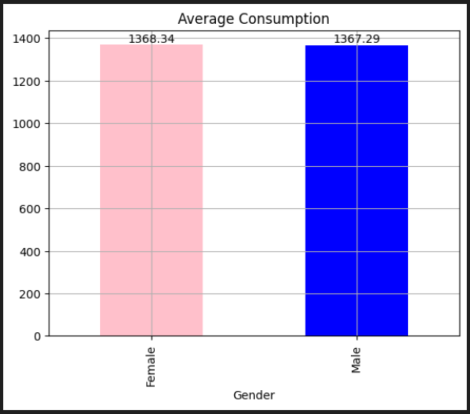

# Retail Data Analysis
Dataset source: https://www.kaggle.com/datasets/sahilprajapati143/retail-analysis-large-dataset?resource=download

Dataset that contains transactions.  
The columns include: age, gender, income, customer segment, totla purchases, amount spent, product category, product brand, product type, shipping method, payment method, and others.

## Objectives to Explore:

1. Customer Level
- Of the customers, which gender dominates the different income categories. ✅
- Age Distribution. ✅
- Age Average. ✅
- Consumption per gender. ✅
- Consumption per gender average. ✅
- Consumption per income category. ✅
- Consumption per income category average. ✅
- Consumption per income category and gender (AKA. Which Gender consumes the most within their Income Category. It answers wheter rich women / men spend most). ✅
- Consumption per income category and gender average. ✅

2. Country Level
- Which country consumes the most on average. ✅
- Which country consumed the most. ✅
- Greatest country consumer  in 2023 by month. ✅
- Why is there such strange results in February regarding monthly consumption?

3. Product Level
- ProductCategory purchase distribution (How much times product category was bought) ✅
- ProductCategory purchases by Gender ✅
- ProductCategory gross sales (How much money worth by product category) ✅
- Brand gross sales ✅
- Brands purchases by Gender ✅
- 

4. Prediction and Inferences
- Does Income relates to total amount?
- Predict Total Amount based on Income, Age, Customer Segment and Total Purchases.

## Results
### 1. Customer Related
#### - Of the customers, which gender dominates the different income categories.
 
There are more females in the Low and Medium income category than males.
And there are more males in the High income category than females.
#### - Age Distribution. 

A lot of retail customers in their early 20s and some interesting high counts for customers of age 34, 46, and 55.
#### - Age Average. 
The average age of the customers in the retail dataset is 35.
#### - Consumption per gender. 
 
Men clients purchased a total of $249,891,824.48.  
Women clients purchased a total of 152,086,424.42
#### - Consumption per gender average. 
 
On average, women and men purchased an average 1368.34 and 1367.29, respectively. This are very similar values, meaning, men and women have similar both contribute equally economically in a retail context.
#### - Consumption per income category. 

#### - Consumption per income category average. 

#### - Consumption per income category and gender (Which category consumed most)

#### - Consumption per income category and gender average. 

### 2. Country Level
#### - Which country consumes the most on average. 

On average, a customer from the UK will consume the most.
#### - Which country consumed the most. 

In total, the country that spends the most is the USA.
#### - Greatest country consumer  in 2023 by month. 

Usually, the USA spends the most each month, but surprisingly, on February there was a huge dip and Australia leaded consumption despite the low value it displays.
#### - Why is there such strange results in February regarding monthly consumption?

The reason why there is such a dip in February regarding monthly consumptions is because in the dataset, in February 2023, there is few transactions.  
The number of transactions was low for every country and Australia happened to have more than any other country, hence why such low consumption and Australia being the greatest consumer in that month and year.

### 3. Product Level
#### - ProductCategory purchase distribution (How much times product category was bought) 
#### - ProductCategory purchases by Gender 
#### - ProductCategory gross sales (How much money worth by product category) 
#### - Brand gross sales 
#### - Brands purchases by Gender 

# WORK IN PROGRESS! - Dec 29